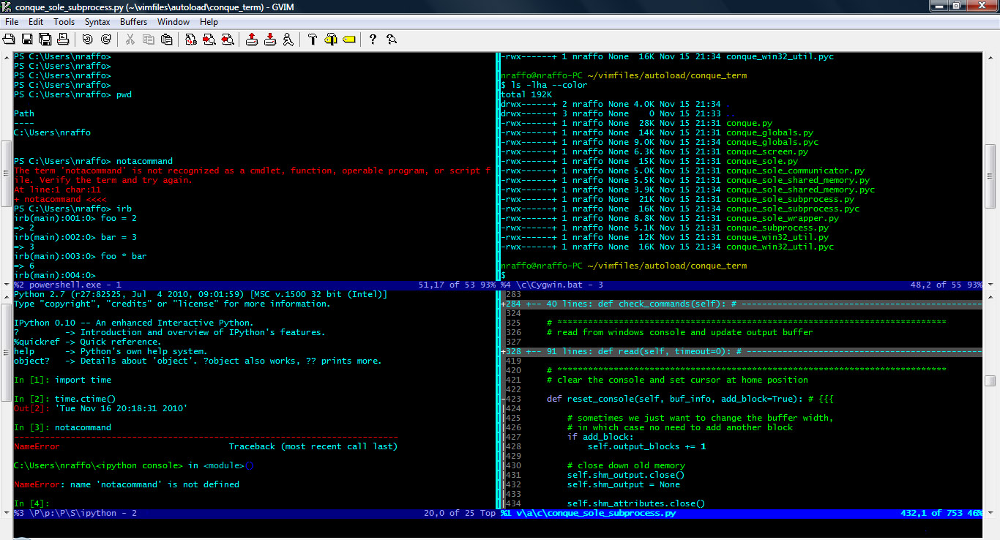

==========
conque.vim
==========
This is a mirror of https://code.google.com/p/conque/.

Conque is a Vim plugin which allows you to run interactive programs, such as bash on linux or powershell.exe on Windows, inside a Vim buffer. In other words it is a terminal emulator which uses a Vim buffer to display the program output.

Website
=======
For more information https://code.google.com/p/conque/.

Screenshots
===========
.. image:: assets/unix.jpg

Usage
=====
Type :ConqueTerm <command> to run your command in vim, for example:

.. code-block:: vim

  :ConqueTerm bash
  :ConqueTerm mysql -h localhost -u joe -p sock_collection
  :ConqueTerm Powershell.exe
  :ConqueTerm C:\Python27\python.exe

To open ConqueTerm in a new horizontal or vertical buffer use:

.. code-block:: vim

  :ConqueTermSplit <command>
  :ConqueTermVSplit <command>
  :ConqueTermTab <command>

All text typed in insert mode will be sent to your shell.
Use the ``<F9>`` key to send a visual selection from any buffer to the shell.

For more help type :help ConqueTerm

Installation
============
NeoBundle (Recommended)
-----------------------
1. Add the following configuration to your ``.vimrc``.

.. code-block:: vim

  NeoBundle 'wkentaro/conque.vim'

2. Install with ``:NeoBundleInstall``.

Manually
--------
#. Put all files under $VIM.

Pathogen
--------
#. If you prefer to install plugins using `Pathogen.vim <https://github.com/tpope/vim-pathogen>`_.

.. code-block:: sh

  $ cd ~/.vim/bundle
  $ git clone https://github.com/wkentaro/conque.vim

Lisence
========
| Copyright (C) 2009-2011 Nico Raffo  
| Released under the MIT license  
| https://github.com/wkentaro/conque.vim/blob/master/LICENSE

